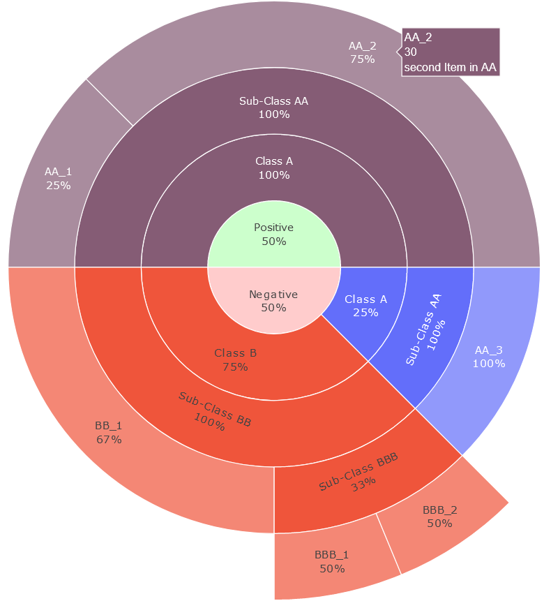

# plotly-tools

Handles the datastructure for multi level hierarchy using "parents" to simplify the creation of plotly sunburst diagrams.

Just add (top-level-)items, all parents will get created and maintained.

